# EDA & Data Pipeline

← [Back to README](../README.md)

---

## Dataset

**UCI Diabetes 130-US Hospitals (1999–2008)**

| Property | Value |
|---|---|
| Source | [UCI ML Repository](https://archive.ics.uci.edu/dataset/296/diabetes+130-us+hospitals+for+years+1999-2008) |
| Rows | 101,766 encounters |
| Columns | 50 raw features |
| Unique patients | 71,518 |
| Multi-visit rows | 47,021 (46.2%) |
| Memory | 48.51 MB |
| Load time | 0.402s |

---

## Target Variable

| Class | Count | Percentage |
|---|---|---|
| NO readmission | 54,864 | 53.91% |
| >30 days | 35,545 | 34.93% |
| <30 days | 11,357 | 11.16% |

Binary target: `<30` and `>30` → **READMIT (1)**, `NO` → **NO READMIT (0)**

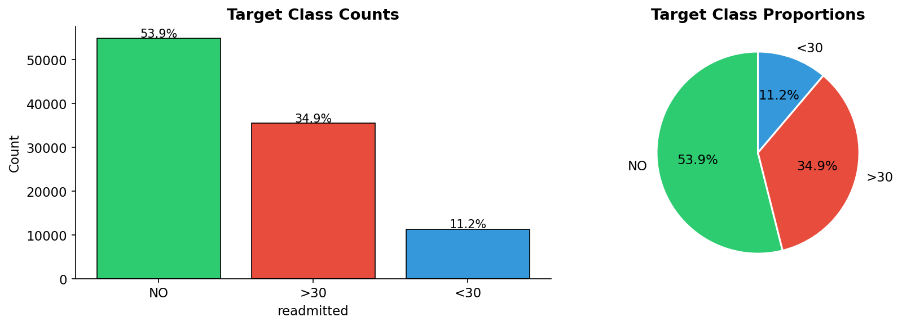

---

## Missing Values

9 columns contained sentinel `?` values replaced with `NaN`:

| Feature | Null count | Null % |
|---|---|---|
| weight | 98,569 | 96.86% |
| max_glu_serum | 96,420 | 94.75% |
| A1Cresult | 84,748 | 83.28% |
| medical_specialty | 49,949 | 49.08% |
| payer_code | 40,256 | 39.56% |
| race | 2,273 | 2.23% |
| diag_3 | 1,423 | 1.40% |
| diag_2 | 358 | 0.35% |
| diag_1 | 21 | 0.02% |

**Total null cells: 374,017 / 5,088,300 (7.35%)**

High-missing features (`weight`, `max_glu_serum`, `A1Cresult`) were converted to binary missingness flags — the absence itself is clinically informative.

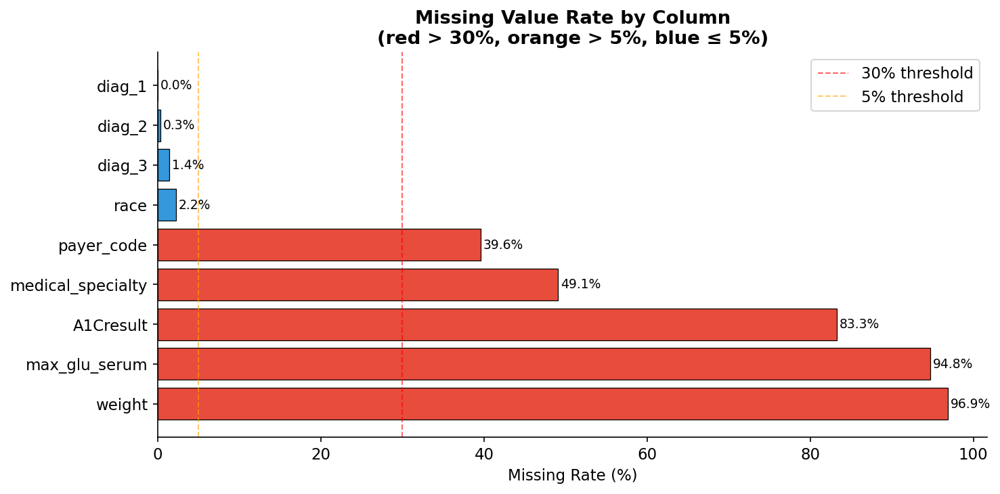
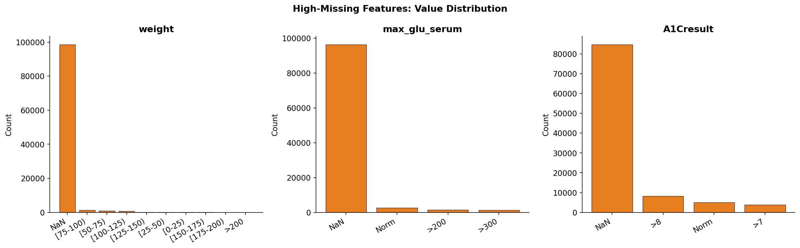

---

## EDA Key Findings

### Numeric Distributions

All 13 numeric features validated: ranges confirmed within clinical bounds, zero out-of-range values detected.

| Feature | Range | Clinical note |
|---|---|---|
| time_in_hospital | [1, 14] | Days |
| num_lab_procedures | [1, 132] | Lab tests per stay |
| num_medications | [1, 81] | Active medications |
| number_diagnoses | [1, 16] | Recorded diagnoses |
| number_inpatient | [0, 21] | Prior inpatient visits |

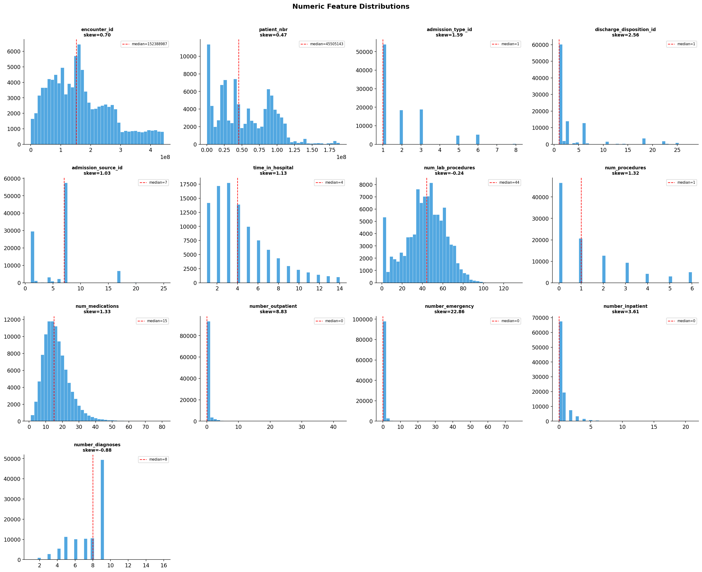
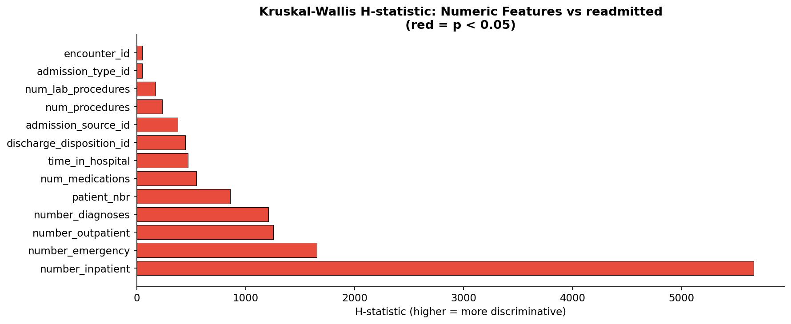
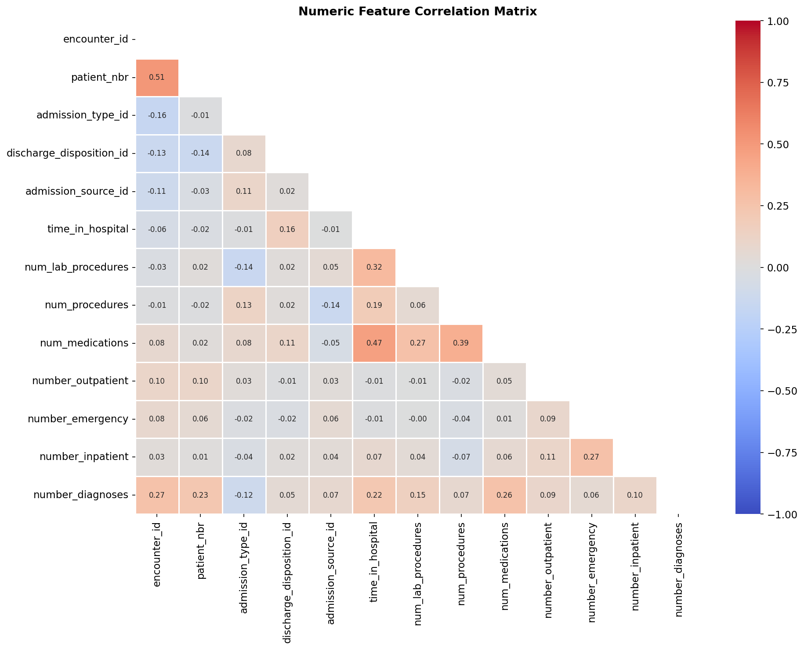

### Categorical Features

| Feature | Classes | Note |
|---|---|---|
| age | 10 bins | [0-10), [10-20), ... [90-100) |
| race | 5 | Caucasian dominant |
| gender | 3 | Male/Female/Unknown |
| payer_code | 17 | Insurance type — high drift later |
| medical_specialty | 68 | Treating specialty |
| diag_1/2/3 | ICD-9 → 18-19 chapters | Grouped by ICD-9 chapter |

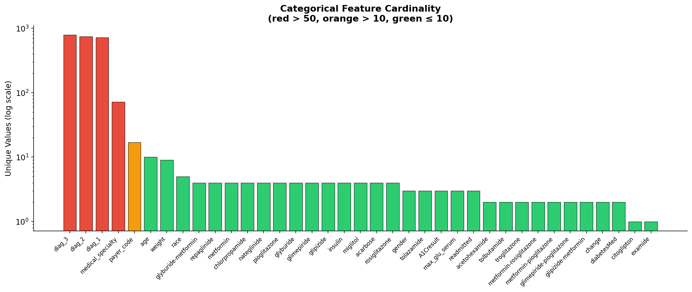
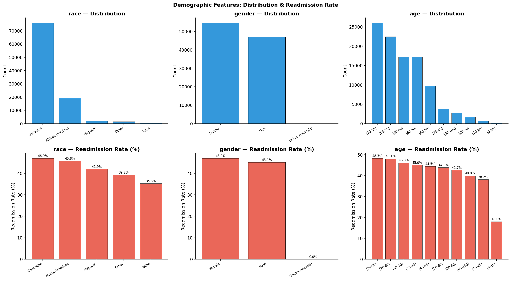

### Medication Analysis

9 ordinal medications (No/Steady/Up/Down) + 7 binary medications.
2 zero-variance columns dropped: `examide`, `citoglipton`.

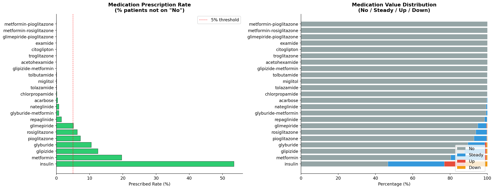

### Diagnosis Codes

Diagnoses grouped into 18-19 ICD-9 chapters:
- **Circulatory**: most frequent (19,608 primary)
- **Endocrine**: second (7,604 primary)
- **Respiratory**: third (6,140 primary)

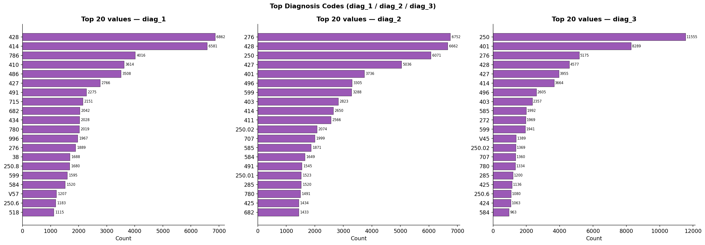
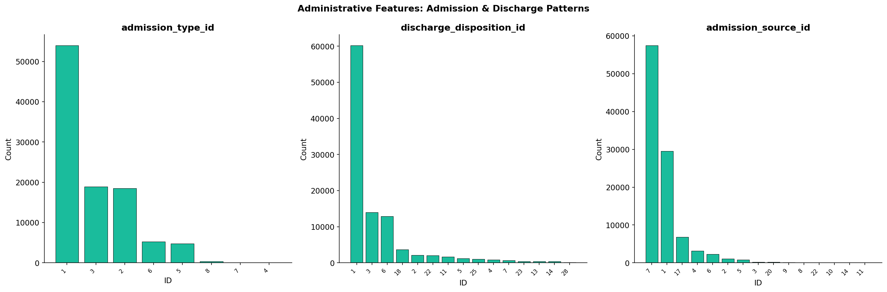

### Multi-visit Patients

23.5% of patients have multiple visits (16,773 patients).
Patient-level split ensures no patient appears in both train and test.

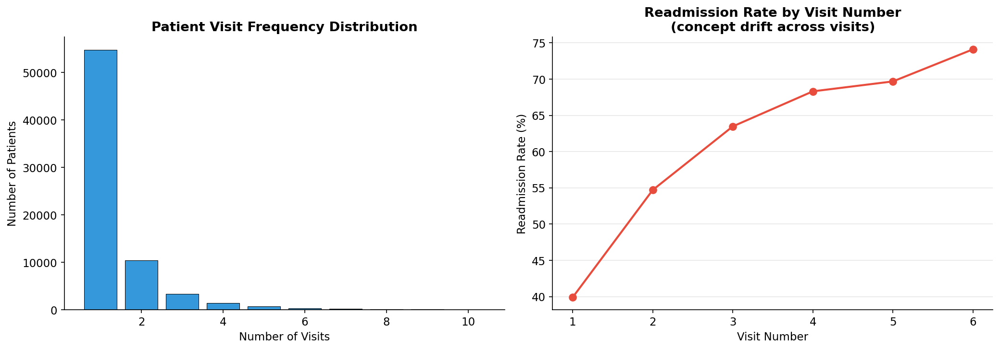

---

## Data Validation

10-check validation suite — all critical checks passed:

| Category | Checks | Result |
|---|---|---|
| Shape & Memory | 3 | ✓ PASS |
| Column Presence | 2 | ✓ PASS |
| Dtype Validation | 50 | ✓ PASS (81 PASS, 2 WARN) |
| Null Audit | 6 | ✓ PASS |
| Clinical Ranges | 11 | ✓ PASS |
| Categorical Integrity | 6 | ✓ PASS |
| Zero-variance | 1 | ⚠ WARN (examide, citoglipton) |
| Duplicate Integrity | 2 | ✓ PASS |
| Monotonicity | 1 | ⚠ WARN (expected) |
| Target Balance | 1 | ✓ PASS |

**Final: PASS=81 WARN=2 FAIL=0**

---

## Patient-Level Entry-Cohort Split

**Strategy**: patients ordered by first `encounter_id` (ascending) → **entry-cohort
ordering**, not a temporal split.

> **Corrected in Phase 0.5.** Tier 0 verified that `encounter_id` ordering *is*
> chronological (`outputs/reports/temporal_validity.json`, verdict SUPPORTED).
> That does **not** make this a temporal split: sorting *patients* by their
> *first* encounter puts every later encounter of an early-entering patient into
> train, which is why the split's `encounter_id` ranges overlap almost entirely.
> A genuine chronological split of *encounters* is implemented separately as the
> `temporal` regime in `src/investigation/split_regimes.py`.

| Split | Patients | Rows | Readmit rate |
|---|---|---|---|
| Train | 42,910 (60%) | 63,492 | 49.0% |
| Val | 14,303 (20%) | 20,949 | 47.6% |
| Test | 14,305 (20%) | 17,325 | **33.6%** ← drift |

**Leakage check**: Train∩Val=0, Train∩Test=0, Val∩Test=0 ✓

The test readmission rate drops from 47.6% to 33.6% — a 14pp label shift that DriftSentinel will detect.