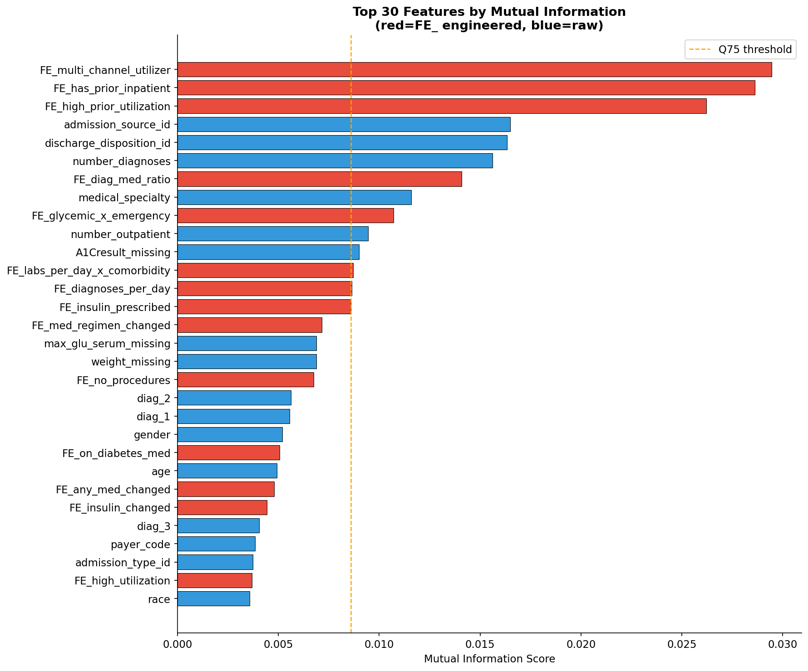
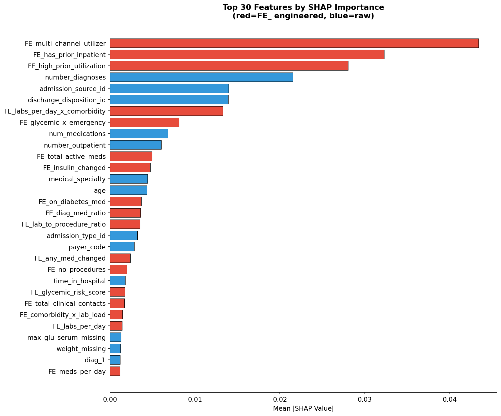
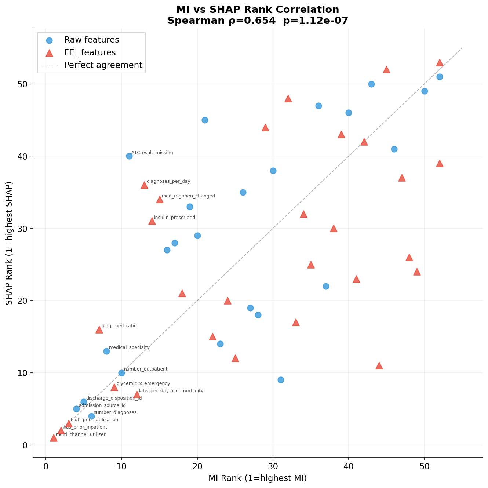
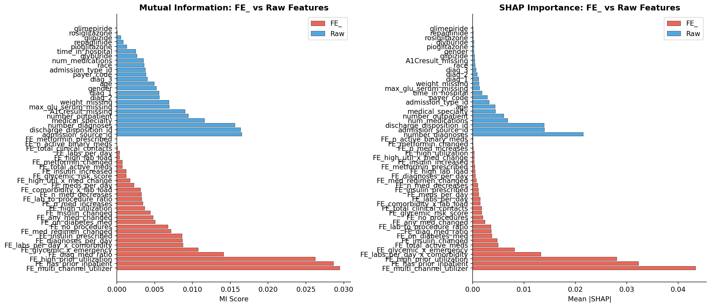
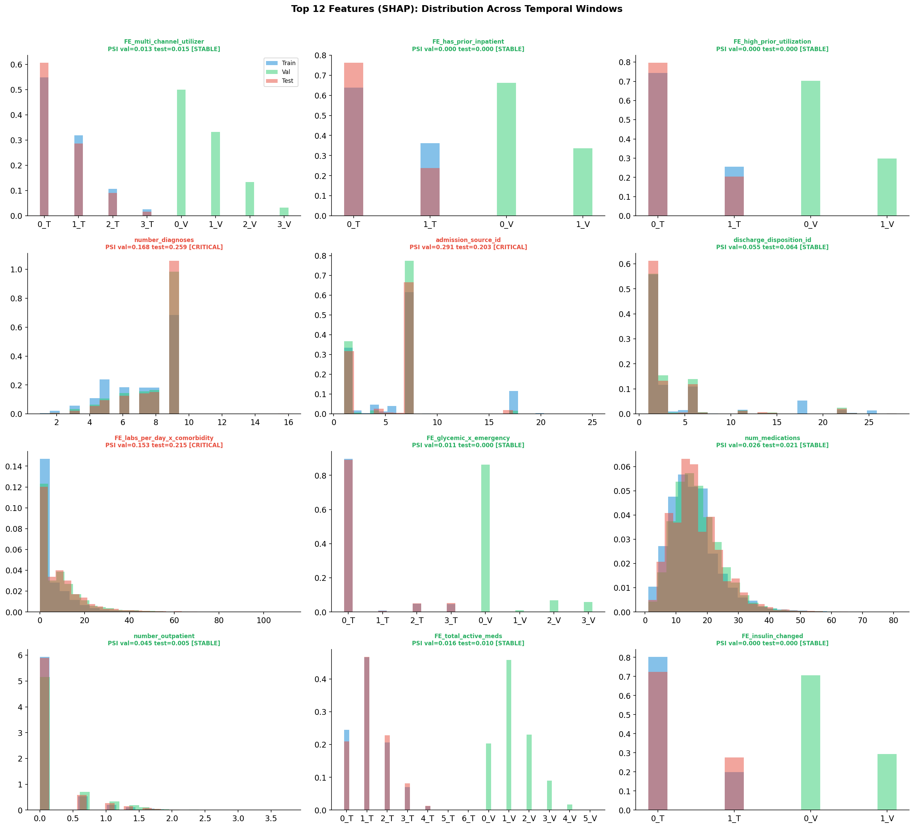

# Feature Engineering

← [Back to README](../README.md)

---

## Overview

38 clinical features engineered across 7 domain groups.
All thresholds fitted on **train split only** — zero leakage.

| Metric | Value |
|---|---|
| Input features | 42 (after preprocessing) |
| FE_ features created | 38 |
| Output features | 80 (42 + 38) |
| Null-free | ✓ All 38 FE_ columns |
| Leakage guard | ✓ No \|r\| > 0.80 with target |
| FE_ in SHAP top-20 | 11/20 |
| FE_ mean SHAP vs raw | 0.00561 vs 0.00358 (+56%) |

---

## Group A — Utilization Intensity

Hospital resource consumption per stay.

| Feature | Formula | Rationale |
|---|---|---|
| FE_total_clinical_contacts | time + procedures + labs | Overall hospital resource load |
| FE_labs_per_day | num_lab_procedures / time_in_hospital | Lab intensity per day |
| FE_meds_per_day | num_medications / time_in_hospital | Medication burden per day |
| FE_procedure_density | num_procedures / (num_lab_procedures + 1) | Procedure vs lab ratio |
| FE_high_utilization | FE_total_clinical_contacts ≥ Q75(train)=62 | Binary high-resource flag |

---

## Group B — Medication Complexity

Pharmacological burden and instability signals.

| Feature | Formula | Rationale |
|---|---|---|
| FE_n_active_ordinal_meds | sum of 9 ordinal meds > 0 | Count of active ordinal medications |
| FE_n_active_binary_meds | sum of 7 binary meds | Count of active binary medications |
| FE_total_active_meds | ordinal_active + binary_active | Total active medication count |
| FE_n_med_changes | meds with Up or Down dose | Instability indicator |
| FE_n_med_increases | meds with Up dose only | Escalation signal |
| FE_n_med_decreases | meds with Down dose only | De-escalation signal |
| FE_any_med_changed | binary flag ≥ 1 dose change | Any medication adjustment |
| FE_polypharmacy | total_active_meds ≥ 5 | Clinical polypharmacy threshold |
| FE_med_coverage_ratio | total_active_meds / (num_medications + 1) | Coverage efficiency |

---

## Group C — Diagnosis Burden

Comorbidity complexity per unit time.

| Feature | Formula | Rationale |
|---|---|---|
| FE_high_comorbidity | number_diagnoses ≥ Q75(train)=9 | High comorbidity binary flag |
| FE_diagnoses_per_day | number_diagnoses / time_in_hospital | Diagnosis density |
| FE_diag_med_ratio | number_diagnoses / (num_medications + 1) | Diagnosis-to-medication ratio |

---

## Group D — Lab & Procedure Load

Diagnostic vs intervention balance.

| Feature | Formula | Rationale |
|---|---|---|
| FE_high_lab_load | num_lab_procedures ≥ Q75(train)=56 | High lab intensity flag |
| FE_no_procedures | num_procedures == 0 | No surgical/therapeutic intervention |
| FE_lab_to_procedure_ratio | num_lab_procedures / (num_procedures + 1) | Diagnostic vs therapeutic ratio |

---

## Group E — Prior Utilization

Historical healthcare usage pattern.

| Feature | Formula | Rationale |
|---|---|---|
| FE_total_prior_contacts | inpatient + outpatient + emergency | Total prior healthcare contacts |
| FE_has_prior_emergency | number_emergency > 0 | Prior ER visit flag |
| FE_has_prior_inpatient | number_inpatient > 0 | Prior inpatient stay flag |
| FE_high_prior_utilization | total_prior_contacts ≥ Q75(train)=1.10 | High prior utilization flag |
| FE_multi_channel_utilizer | count of channels with > 0 visits | Multi-channel access count (0-3) |

**`FE_multi_channel_utilizer` is the #1 feature by MI, SHAP, and Boruta.**

---

## Group F — Diabetes Management

Glycemic control quality indicators.

| Feature | Formula | Rationale |
|---|---|---|
| FE_insulin_prescribed | insulin > 0 | Any insulin use |
| FE_insulin_changed | insulin Up or Down | Insulin dose adjustment |
| FE_insulin_increased | insulin Up only | Insulin escalation |
| FE_metformin_prescribed | metformin > 0 | Metformin use |
| FE_metformin_changed | metformin Up or Down | Metformin adjustment |
| FE_on_diabetes_med | diabetesMed (pass-through) | On any diabetes medication |
| FE_med_regimen_changed | change (pass-through) | Any regimen change |
| FE_glycemic_risk_score | sum of 3 glycemic indicators | Composite glycemic risk |

---

## Group G — Interaction Features

Non-linear clinical risk combinations.

| Feature | Formula | Rationale |
|---|---|---|
| FE_inpatient_x_polypharmacy | prior_inpatient × polypharmacy | High-risk combination |
| FE_high_util_x_med_change | high_utilization × any_med_changed | Utilization + instability |
| FE_comorbidity_x_lab_load | high_comorbidity × high_lab_load | Complexity × investigation |
| FE_glycemic_x_emergency | glycemic_risk_score × has_prior_emergency | Glycemic risk + ER history |
| FE_labs_per_day_x_comorbidity | labs_per_day × high_comorbidity | Lab intensity × complexity |

---

## Feature Importance — Mutual Information

Computed on train split only (discrete_features='auto', random_state=42).

| Rank | Feature | MI Score | Type |
|---|---|---|---|
| 1 | FE_multi_channel_utilizer | 0.0295 | FE_ |
| 2 | FE_has_prior_inpatient | 0.0286 | FE_ |
| 3 | FE_high_prior_utilization | 0.0262 | FE_ |
| 4 | admission_source_id | 0.0165 | raw |
| 5 | discharge_disposition_id | 0.0163 | raw |
| 6 | number_diagnoses | 0.0156 | raw |
| 7 | FE_diag_med_ratio | 0.0141 | FE_ |
| 8 | medical_specialty | 0.0116 | raw |
| 9 | FE_glycemic_x_emergency | 0.0107 | FE_ |
| 10 | number_outpatient | 0.0095 | raw |

**FE_ in top 20: 10/20**

---

## Feature Importance — SHAP

RandomForest (n_estimators=200, max_depth=8) on train split.
Mean |SHAP| per feature.

| Rank | Feature | SHAP Mean | Type |
|---|---|---|---|
| 1 | FE_multi_channel_utilizer | 0.0434 | FE_ |
| 2 | FE_has_prior_inpatient | 0.0323 | FE_ |
| 3 | FE_high_prior_utilization | 0.0280 | FE_ |
| 4 | number_diagnoses | 0.0215 | raw |
| 5 | admission_source_id | 0.0140 | raw |
| 6 | discharge_disposition_id | 0.0139 | raw |
| 7 | FE_labs_per_day_x_comorbidity | 0.0133 | FE_ |
| 8 | FE_glycemic_x_emergency | 0.0081 | FE_ |
| 9 | num_medications | 0.0068 | raw |
| 10 | number_outpatient | 0.0060 | raw |

**FE_ in SHAP top-20: 11/20**

---

## MI vs SHAP Rank Correlation

**Spearman ρ = 0.6537** — moderate agreement between MI and SHAP rankings.

Both methods independently rank `FE_multi_channel_utilizer` as #1. Divergences indicate features with strong non-linear signal (MI) vs model-specific contribution (SHAP).

---

## FE_ vs Raw Feature Comparison

| Metric | FE_ features | Raw features | Advantage |
|---|---|---|---|
| MI mean | 0.006504 | 0.005835 | FE_ +11% |
| SHAP mean | 0.005606 | 0.003583 | **FE_ +56%** |
| High-risk count | 7 | 9 | — |

Engineered features contribute 56% more SHAP value on average than raw features, validating the domain engineering approach.

---

## Top Feature Distributions Across Splits

Top 12 features by SHAP visualized across train/val/test windows.
Shows which features are stable and which drift.

---

[→ Model Training](03_model_training.md)