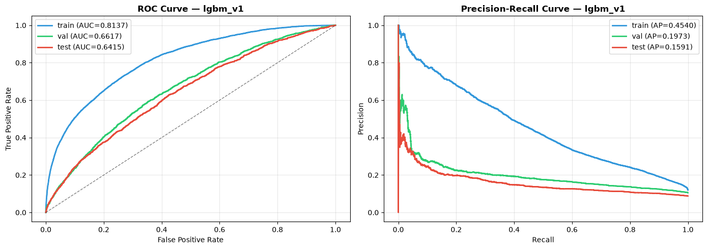
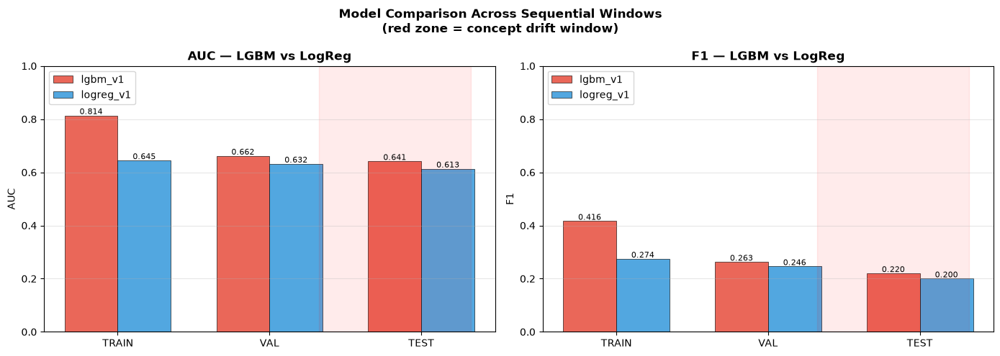
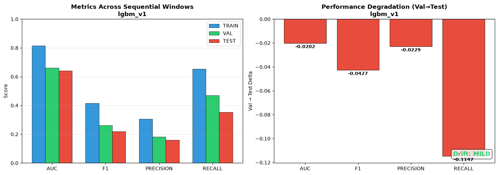
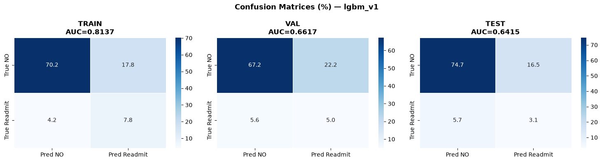
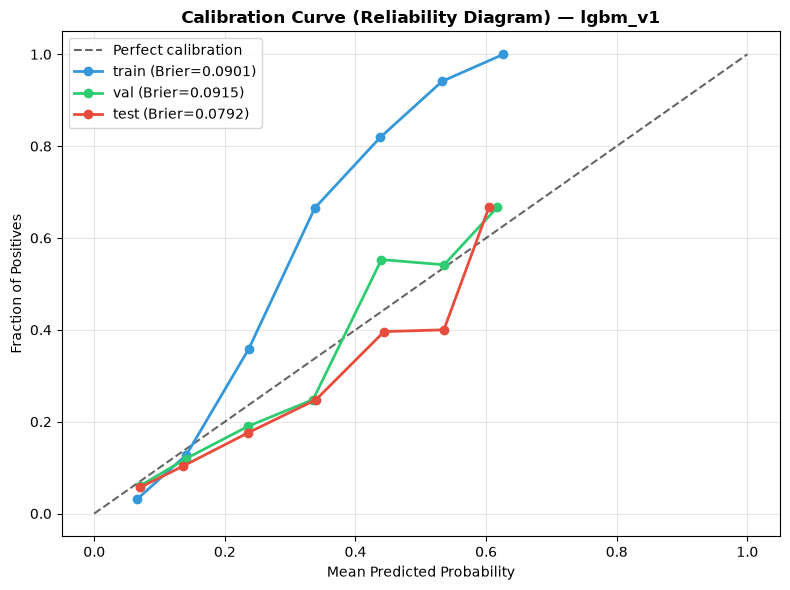

# Model Training

← [Back to README](../README.md)

---

## Overview

Two models trained on **train split only**.
Val split used for early stopping and threshold selection.
Test split touched only once — final evaluation.

| Model | Purpose | Val AUC | Val F1 |
|---|---|---|---|
| LightGBM (lgbm_v1) | Primary model | 0.6865 | 0.6735 |
| Logistic Regression (logreg_v1) | Baseline | 0.6451 | 0.6519 |

---

## LightGBM — lgbm_v1

### Configuration

| Parameter | Value |
|---|---|
| objective | binary |
| metric | auc |
| learning_rate | 0.05 |
| num_leaves | 63 |
| min_child_samples | 50 |
| feature_fraction | 0.8 |
| bagging_fraction | 0.8 |
| bagging_freq | 5 |
| reg_alpha | 0.1 |
| reg_lambda | 0.1 |
| n_estimators (max) | 1000 |
| early_stopping | 50 rounds |
| random_state | 42 |

### Cross-Validation (5-fold stratified, train split)

| Metric | Mean | Std |
|---|---|---|
| AUC | 0.7186 | ±0.0041 |
| F1 | 0.6522 | ±0.0056 |

Low std confirms stable training — no overfitting to a single fold.

### Training Result

- **Best iteration**: 173 (early stopped from 1000)
- **Training time**: 2.60s
- **Optimal threshold** (F1-max on val): 0.3958

### Val Performance

| Metric | Value |
|---|---|
| AUC | 0.6865 |
| F1 | 0.6735 |
| Precision | 0.5286 |
| Recall | 0.9278 |
| Brier | 0.2301 |

### Top 10 Features by Gain

| Feature | Gain | Type |
|---|---|---|
| FE_lab_to_procedure_ratio | 812 | FE_ |
| FE_total_clinical_contacts | 723 | FE_ |
| FE_labs_per_day | 700 | FE_ |
| FE_diag_med_ratio | 682 | FE_ |
| FE_meds_per_day | 655 | FE_ |
| discharge_disposition_id | 606 | raw |
| medical_specialty | 586 | raw |
| admission_source_id | 495 | raw |
| num_medications | 476 | raw |
| payer_code | 424 | raw |

**5/10 top features are FE_ engineered features.**

---

## Logistic Regression — logreg_v1

### Configuration

| Parameter | Value |
|---|---|
| C | 0.1 |
| max_iter | 1000 |
| solver | lbfgs |
| calibration | CalibratedClassifierCV (isotonic, cv=3) |
| scaling | StandardScaler (fitted on train) |

### Cross-Validation (5-fold stratified)

| Metric | Mean | Std |
|---|---|---|
| AUC | 0.6703 | ±0.0038 |
| F1 | 0.5880 | ±0.0026 |

### Val Performance

| Metric | Value |
|---|---|
| AUC | 0.6451 |
| F1 | 0.6519 |
| Precision | 0.5687 |
| Recall | 0.6498 |
| Brier | 0.2364 |

### Top 10 Features by |Coefficient|

| Feature | |Coef| | Type |
|---|---|---|
| number_diagnoses | 0.3035 | raw |
| FE_multi_channel_utilizer | 0.2684 | FE_ |
| FE_high_prior_utilization | 0.1712 | FE_ |
| FE_diag_med_ratio | 0.1121 | FE_ |
| FE_has_prior_inpatient | 0.1118 | FE_ |
| max_glu_serum_missing | 0.1061 | raw |
| FE_on_diabetes_med | 0.1025 | FE_ |
| discharge_disposition_id | 0.0947 | raw |
| FE_insulin_changed | 0.0937 | FE_ |
| num_medications | 0.0918 | raw |

---

## Model Comparison (Val Split)

| Model | AUC | F1 | Precision | Recall |
|---|---|---|---|---|
| **lgbm_v1** | **0.6865** | **0.6735** | 0.5286 | **0.9278** |
| logreg_v1 | 0.6451 | 0.6519 | **0.5687** | 0.6498 |

LGBM wins on AUC (+0.0414) and Recall (+0.278).
LogReg slightly better on Precision (+0.040).
**LGBM selected as primary model.**

---

## Performance Degradation (Val → Test)

Model performance across the **entry-cohort** windows (val → test).

> **Phase 0.5 correction.** Previously described as "the core DriftSentinel
> finding — model performance under temporal drift". Two corrections: this is an
> entry-cohort contrast, not a temporal one; and Tier 0 showed the same pipeline
> reports degradation on a **random split where drift cannot exist**, so this
> table must be read against that baseline (`outputs/reports/regime_random.json`).

| Metric | Train | Val (reference) | Test (drifted) | Val→Test Δ |
|---|---|---|---|---|
| **AUC** | 0.7891 | 0.6865 | 0.6560 | **−0.0305** ↓ |
| **F1** | 0.7292 | 0.6735 | 0.5299 | **−0.1436** ↓ |
| **Precision** | 0.6322 | 0.5286 | 0.3726 | **−0.1560** ↓ |
| **Recall** | 0.8613 | 0.9278 | 0.9171 | −0.0107 ↓ |
| **Brier** | 0.1904 | 0.2301 | 0.2520 | +0.0219 ↑ |
| **mean_proba** | 0.4901 | 0.5648 | 0.5418 | −0.0230 ↓ |

**Precision collapse: 52.9% → 37.3% (−15.6pp)**

Model still predicts readmission aggressively (Recall=91.7%) but
the proportion of correct predictions collapsed — direct consequence
of label shift (readmit rate: 47.6% → 33.6%).

---

## Calibration

| Split | ECE (before) | Note |
|---|---|---|
| Val | 0.0884 | Model reasonably calibrated on reference |
| Test | 0.2054 | **Severe miscalibration under drift** |

Calibration degrades significantly on the drifted test window.
Isotonic recalibration reduces test ECE to 0.1173 (−43%).

See [Uncertainty Quantification](05_uncertainty.md) for full calibration analysis.

---

## Model Registry

After drift detection, `lgbm_v2` was trained on `train + val` (84,441 rows).

| Model | Trigger | Train rows | Test AUC | Test F1 | Status |
|---|---|---|---|---|---|
| lgbm_v1 | manual | 63,492 | 0.6560 | 0.5299 | superseded |
| **lgbm_v2** | **drift_alert** | **84,441** | **0.6648** | **0.5368** | **active** |

**Verdict: PROMOTE** — lgbm_v2 improves on all metrics vs lgbm_v1 on test split.

Full drift detection story: [Drift Detection](04_drift_detection.md)

---

## Reference Predictions (Drift Baseline)

Val predictions saved as production reference:

| Model | Mean proba on val |
|---|---|
| lgbm_v1 | 0.5648 |
| logreg_v1 | 0.5325 |

When test mean proba drops to 0.5418, this delta (−0.023) becomes
one of 8 evidence signals for concept drift.

---

[→ Drift Detection](04_drift_detection.md)