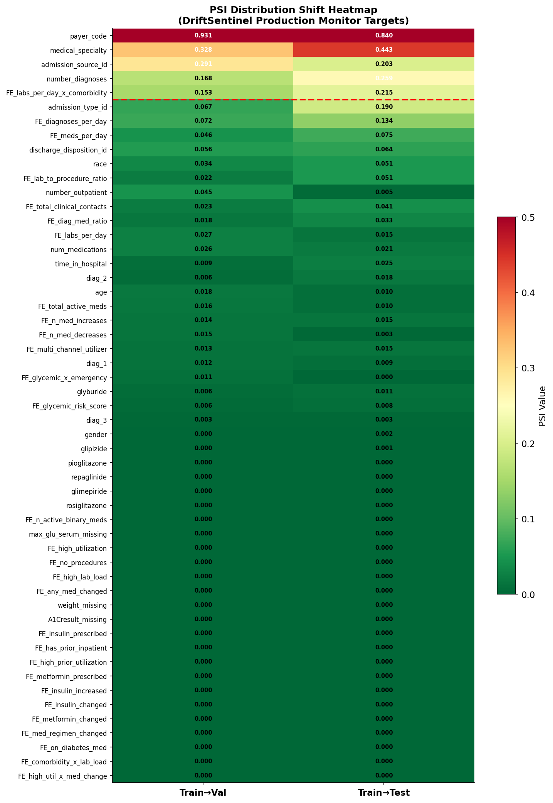
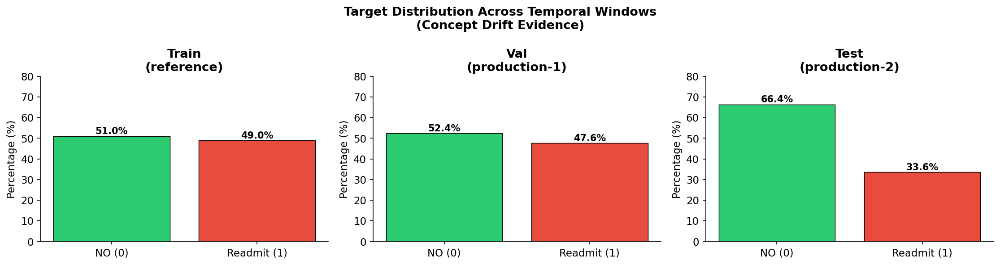

# Drift Detection

← [Back to README](../README.md)

---

## What is Drift?

A deployed model learns patterns from historical data. When the real world
changes — patient demographics shift, billing codes change, disease
prevalence drops — the model's learned patterns no longer hold.
**Performance degrades silently, without any error or warning.**

In this project, newer patients (test window) have different insurance
patterns, fewer diagnoses, and a 14pp lower readmission rate than the
training population. The model was never told. DriftSentinel found out.

---

## Before Drift → After Drift

| Metric | Val (deployed) | Test (production) | Delta |
|---|---|---|---|
| AUC | 0.6865 | 0.6560 | **−0.0305** |
| F1 | 0.6735 | 0.5299 | **−0.1436** |
| Precision | 0.5286 | 0.3726 | **−0.1560** |
| Recall | 0.9278 | 0.9171 | −0.0107 |
| Readmission rate | 47.6% | 33.6% | **−14.0pp** |

Precision collapsed from 52.9% to 37.3% — the model kept predicting
readmission at the old rate, but far fewer patients actually were readmitted.

---

## Detection Pipeline

Four modules run in sequence, each adding independent evidence:

| Module | Method | Result |
|---|---|---|
| `data_drift.py` | PSI, KS, Chi², JS, Mann-Whitney per feature | 31/53 drifted, 5 PSI critical |
| `feature_drift.py` | Drift score × SHAP importance × SHAP shift | 16 HIGH risk features |
| `concept_drift.py` | CUSUM, Page-Hinkley, sliding window AUC | 8/8 evidence signals fired |
| `alerting.py` | Multi-source alert engine, severity tiers | 4 CRITICAL + 5 HIGH alerts |

---

## Data Drift — Which Features Shifted

5 features with PSI > 0.20 (critical) when comparing train → test:

| Feature | PSI | Why it matters |
|---|---|---|
| payer_code | 0.84 | Insurance type mix changed completely |
| medical_specialty | 0.44 | Treating specialty distribution shifted |
| number_diagnoses | 0.26 | Newer patients have fewer diagnoses |
| FE_labs_per_day_x_comorbidity | 0.21 | Lab intensity × comorbidity interaction drifted |
| admission_source_id | 0.20 | Admission pathways changed |

**31/53 features drifted** (train→test), confirmed by ≥2 statistical tests each.

`payer_code` is the most dangerous: PSI=0.84 AND the model relies
on it more in production (SHAP +10.0%). High drift + increasing
model dependency = precision collapse.



---

## Feature Drift — SHAP Impact Ranking

Drift score alone is insufficient. A drifted feature that the model
ignores has no effect. Impact score combines:

**impact = drift_severity × model_importance × SHAP_shift**

Top HIGH risk features (impact ≥ 0.35):

| Feature | Impact | Drifted | SHAP ref | SHAP Δ% |
|---|---|---|---|---|
| FE_multi_channel_utilizer | 0.456 | YES | 0.233 | −5.5% |
| FE_lab_to_procedure_ratio | 0.454 | YES | 0.054 | +9.4% |
| payer_code | 0.430 | YES | 0.069 | +10.0% |
| number_diagnoses | 0.407 | YES | 0.128 | +5.9% |
| discharge_disposition_id | 0.405 | YES | 0.156 | −4.2% |
| medical_specialty | 0.395 | YES | 0.122 | −0.8% |

**Risk tiers**: HIGH=16, MEDIUM=13, LOW=24

---

## Concept Drift — 8/8 Evidence Signals

| Signal | Result | Value |
|---|---|---|
| AUC drop | ✓ FIRED | −0.0305 |
| F1 drop | ✓ FIRED | −0.1436 |
| Brier increase | ✓ FIRED | +0.0219 |
| CUSUM alarm | ✓ FIRED | 109 alarms, first at **3.92%** of stream |
| Page-Hinkley alarm | ✓ FIRED | 6 alarms, first at 62.95% |
| Prediction distribution shift | ✓ FIRED | KS p=0.000 |
| Label shift | ✓ FIRED | −14.0pp readmission rate |
| AUC slope negative | ✓ FIRED | −0.001232/window |

**CUSUM fires at 3.92%** — drift is detectable almost immediately when
the test window begins. Page-Hinkley catches the slower gradual component.
Together they cover both abrupt and gradual drift patterns.

AUC trend across 20 windows (val → test):
```
Val:  0.675 → 0.665 → 0.661 → 0.695 → 0.696 → 0.686 → 0.688 → 0.702 → 0.671 → 0.669
Test: 0.659 → 0.673 → 0.626 → 0.657 → 0.646 → 0.638 → 0.659 → 0.676 → 0.709 → 0.647
```




---

## Alert System — CRITICAL

9 alerts fired: 4 CRITICAL + 5 HIGH.

| Alert ID | Level | Description |
|---|---|---|
| CD-002 | 🔴 CRITICAL | F1 dropped 0.1436 — threshold 0.05 exceeded |
| CD-003 | 🔴 CRITICAL | 8/8 concept drift signals confirmed |
| DD-001 | 🔴 CRITICAL | 47.2% of features show distribution shift |
| LS-001 | 🔴 CRITICAL | Readmission rate shifted −14.0pp |
| CD-001 | 🟠 HIGH | AUC degradation −0.0305 |
| CD-004 | 🟠 HIGH | CUSUM: 109 alarms, first at 3.92% |
| CD-005 | 🟠 HIGH | Page-Hinkley: gradual drift confirmed |
| FI-001 | 🟠 HIGH | FE_multi_channel_utilizer impact=0.456 |
| FI-002 | 🟠 HIGH | 16 HIGH-risk features identified |

```
SYSTEM STATUS  : CRITICAL
RECOMMENDATION : IMMEDIATE ACTION REQUIRED.
                 Trigger emergency retraining pipeline.
```

---

## Retraining → Recovery

Registry detects `drift_alert` → retrains `lgbm_v2` on `train + val` combined.

| Model | Trigger | Train rows | Test AUC | Test F1 | Status |
|---|---|---|---|---|---|
| lgbm_v1 | manual | 63,492 | 0.6560 | 0.5299 | superseded |
| **lgbm_v2** | **drift_alert** | **84,441** | **0.6648** | **0.5368** | **active** |

**Verdict: PROMOTE → lgbm_v2 becomes active production model.**

---

[→ Uncertainty Quantification](05_uncertainty.md)
