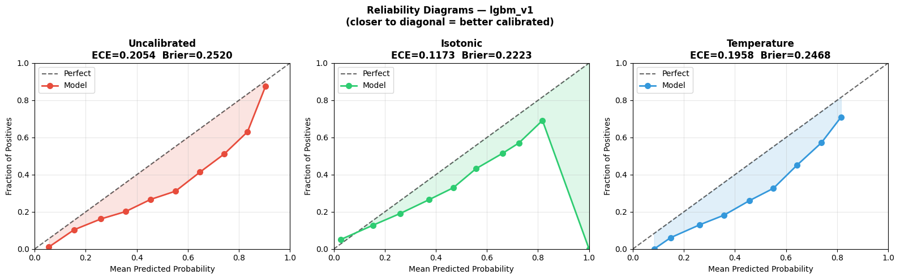
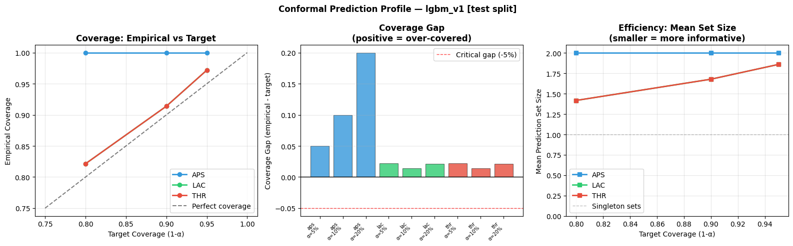
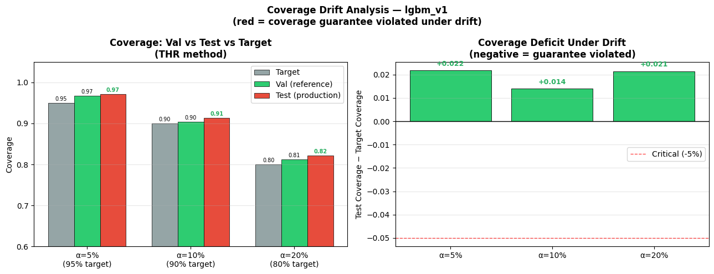
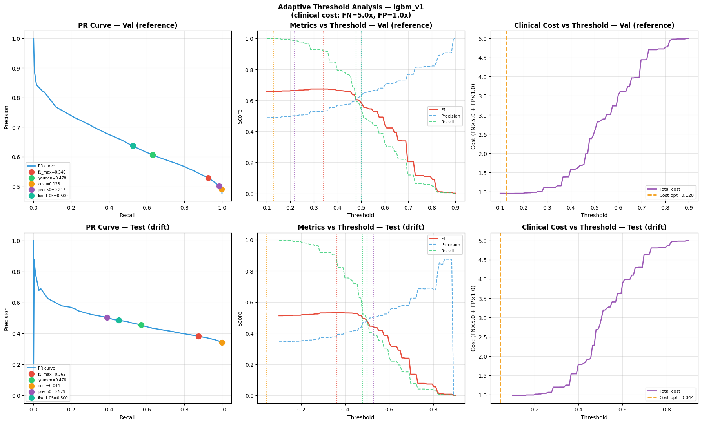
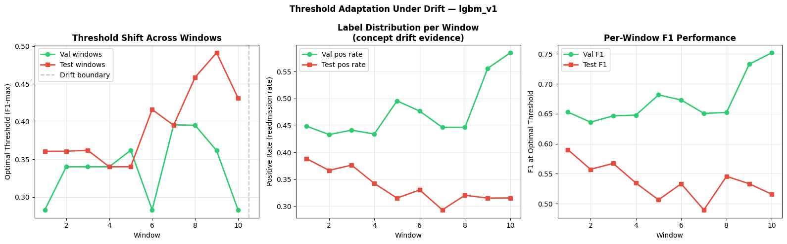

# Uncertainty Quantification

← [Back to README](../README.md)

---

## Overview

Three uncertainty modules applied after model training:

| Module | Method | Key result |
|---|---|---|
| `calibration.py` | Isotonic + Temperature scaling | ECE: 0.2054 → 0.1173 (−43%) |
| `quantifier.py` | Conformal Prediction (THR/LAC/APS) | 91.4% coverage (target 90%) ✓ |
| `threshold.py` | Cost-sensitive adaptive threshold | Recall: 45.3% → 99.5% (+54.2pp) |

---

## Calibration

A model is well-calibrated if predicted probability p=0.70 means
the patient is readmitted 70% of the time. LightGBM is overconfident
on the drifted test window — it predicts high probabilities but
actual outcomes are lower.

### Before calibration

| Split | ECE | Brier | Mean proba | Mean label | Gap |
|---|---|---|---|---|---|
| Val | 0.0884 | 0.2301 | 0.5648 | 0.4764 | +0.088 |
| Test | 0.2054 | 0.2520 | 0.5418 | 0.3364 | +0.205 |

ECE=0.2054 on test means predictions are systematically off by 20pp.

### After calibration (fitted on val, applied to test)

| Method | ECE | Brier | Improvement |
|---|---|---|---|
| Isotonic regression | **0.1173** | 0.2223 | **−43%** ← BEST |
| Temperature (T=1.305) | 0.1958 | 0.2468 | −5% |
| Uncalibrated | 0.2054 | 0.2520 | baseline |

Temperature T=1.305 > 1 → softer predictions (less confident).
Isotonic regression is non-parametric and adapts to the actual
calibration curve shape — outperforms temperature scaling significantly.

---

## Conformal Prediction

Standard ML gives a point estimate: "This patient has 73% readmission risk."
Conformal Prediction gives a **prediction set with a coverage guarantee**:
"With 90% probability, the true outcome is in {READMISSION}."

The guarantee is distribution-free — it holds regardless of drift,
provided the calibration set (val) is exchangeable with production (test).

### Coverage results on test split

| Method | α | Target | Empirical | Gap | Set size | Satisfied |
|---|---|---|---|---|---|---|
| THR | 5% | 95.0% | 97.2% | +0.022 | 1.860 | ✓ |
| THR | **10%** | **90.0%** | **91.4%** | **+0.014** | **1.679** | **✓** |
| THR | 20% | 80.0% | 82.1% | +0.021 | 1.418 | ✓ |
| LAC | 10% | 90.0% | 91.4% | +0.014 | 1.679 | ✓ |
| APS | 10% | 90.0% | 100.0% | +0.100 | 2.000 | ✓ (inefficient) |

All 9 predictors satisfy their coverage guarantees — even under drift.
APS always includes both classes (set_size=2.0), making it uninformative.
**THR is the recommended method**: coverage satisfied + smallest set size.

### Single patient example (THR, 90% guarantee)

| p(readmit) | Prediction set | Certainty |
|---|---|---|
| 0.25 | [NO readmission] | CERTAIN |
| 0.45 | [NO readmission, READMISSION] | UNCERTAIN |
| 0.55 | [NO readmission, READMISSION] | UNCERTAIN |
| 0.75 | [READMISSION] | CERTAIN |
| 0.90 | [READMISSION] | CERTAIN |

Patients with p ∈ [0.36, 0.64] receive uncertain sets — a clinically
actionable signal. Instead of a false point estimate, the clinician
knows this patient needs additional review.

### Coverage drift analysis

Coverage guarantee holds under drift (drift_signals=0/9):

| Method | Val coverage | Test coverage | Delta | Guaranteed |
|---|---|---|---|---|
| thr_a05 | 0.968 | 0.972 | +0.004 | YES |
| thr_a10 | 0.904 | 0.914 | +0.010 | YES |
| thr_a20 | 0.812 | 0.821 | +0.009 | YES |

Coverage actually improves slightly on test — calibration on val
provides conservative enough quantiles that the guarantee holds.

---

## Adaptive Threshold

Default threshold 0.50 is suboptimal for clinical use.
Under drift, the optimal threshold shifts — val-fitted threshold
may not be the best for the drifted test distribution.

### Threshold methods (fitted on val)

| Method | Threshold | Optimizes |
|---|---|---|
| f1_max | 0.3401 | F1 score |
| youden | 0.4784 | Sensitivity + Specificity |
| cost_sensitive | **0.1282** | FN×5 + FP×1 cost |
| prec50 | 0.2169 | Max recall at ≥50% precision |
| fixed | 0.5000 | Default |

### Applied to test (drift window)

| Threshold | F1 | Recall | FN rate | Clinical cost |
|---|---|---|---|---|
| fixed 0.50 | 0.4683 | 45.3% | 54.7% | 2.979 |
| f1_max 0.340 | 0.5299 | 91.7% | 8.3% | 1.197 |
| prec50 0.217 | 0.5178 | 98.0% | 2.0% | 1.013 |
| **cost 0.128** | **0.5126** | **99.5%** | **0.5%** | **0.982** |

### Clinical impact

With **cost-sensitive threshold (0.128)** vs fixed (0.50):
- Recall: 45.3% → 99.5% **(+54.2pp)**
- Missed readmissions: 3,158 → **29** (−3,129 patients)
- F1: 0.4683 → 0.5126 (+0.044)

In clinical terms: fixed threshold misses 55% of readmissions.
Cost-sensitive threshold catches nearly all of them at the cost
of more interventions — appropriate when FN is 5× more costly than FP.

### Threshold drift across windows

| Split | Threshold range | Mean |
|---|---|---|
| Val windows | [0.283, 0.396] | 0.338 |
| Test windows | [0.340, 0.491] | 0.396 |
| **Shift** | — | **+0.057** |

Optimal threshold increases by 0.057 in the test window —
confirming that drift recalibrates the decision boundary.

---

[→ Adversarial Robustness](06_adversarial.md)