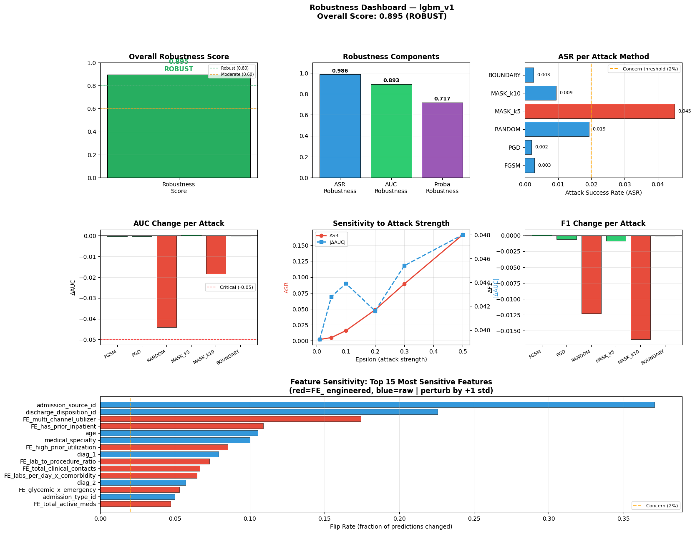
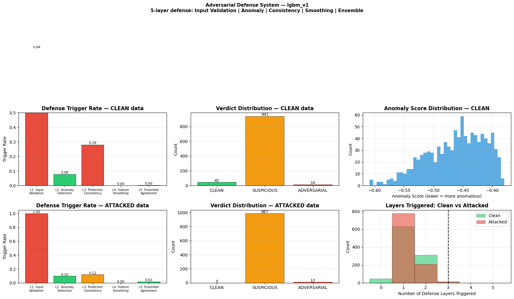

# Adversarial Robustness

← [Back to README](../README.md)

---

## Overview

Three modules evaluate model robustness against adversarial inputs
and defend against them.

| Module | Purpose | Key result |
|---|---|---|
| `attacks.py` | 6 attack methods on test split | MASK_k5 strongest (ASR=4.51%) |
| `robustness.py` | Aggregate robustness score | 0.8954 — **ROBUST tier** |
| `defense.py` | 5-layer defense system | Detection rate=100%, FP=1.4% |

---

## Why Adversarial Robustness for Clinical ML?

In hospital readmission prediction, adversarial inputs are not
hypothetical. A billing department could reduce reported diagnoses
to avoid a readmission flag. A data entry error could zero out key
utilization features. DriftSentinel tests whether the model can be
fooled and whether such attempts can be detected.

---

## Attack Methods

All attacks run on the test split (17,325 samples).
Goal: flip prediction from READMISSION → NO readmission.

| Attack | Method | ASR | ΔAUC | Description |
|---|---|---|---|---|
| FGSM | Gradient-based (finite diff) | 0.29% | −0.0004 | Fast gradient sign, ε=0.1 |
| PGD | Iterative FGSM (10 steps) | 0.20% | −0.0003 | Projected gradient descent |
| RANDOM | Gaussian noise injection | 1.93% | −0.0441 | ε=0.1, random perturbation |
| **MASK_k5** | **Zero top-5 features** | **4.51%** | +0.0004 | **Replace with median** |
| MASK_k10 | Zero top-10 features | 0.94% | −0.0185 | Replace with median |
| BOUNDARY | Move toward decision boundary | 0.26% | −0.0002 | Iterative boundary search |

**ASR (Attack Success Rate)** = fraction of positive predictions flipped to negative.

### Key findings

**FGSM/PGD are ineffective** (ASR < 0.3%) — gradient signal in tabular
medical data is weak. Features are ordinal and bounded; small gradient
steps rarely cross decision boundaries.

**RANDOM has highest AUC drop** (−0.044) — random noise disrupts the
overall probability distribution even without flipping many predictions.

**MASK_k5 has highest ASR** (4.51%) — zeroing the top-5 features
by importance flips 530 predictions. This simulates a realistic attack:
deliberately omitting key clinical information.

---

## Robustness Score

Overall score aggregates three components:

| Component | Score | Formula |
|---|---|---|
| ASR robustness | 0.9864 | 1 − mean(ASR) |
| AUC robustness | 0.8935 | 1 − mean(\|ΔAUC\|) / 0.10 |
| Proba robustness | 0.7172 | 1 − mean(\|Δproba\|) / 0.10 |
| **Overall** | **0.8954** | 0.40×ASR + 0.40×AUC + 0.20×Proba |

**Tier: ROBUST** (threshold ≥ 0.80)

### Epsilon sensitivity

Model resistance as attack strength increases:

| ε | ASR | ΔAUC |
|---|---|---|
| 0.01 | 0.20% | −0.039 |
| 0.05 | 0.50% | −0.043 |
| 0.10 | 1.59% | −0.044 |
| 0.20 | 4.86% | −0.042 |
| 0.30 | 8.92% | −0.045 |
| 0.50 | 16.65% | −0.048 |

Model remains robust up to ε=0.20. At ε=0.50 (unrealistically
large perturbation), ASR reaches 16.7% — still recoverable.

### Most sensitive features

| Feature | Flip rate | Δproba |
|---|---|---|
| admission_source_id | 37.1% | −0.101 |
| discharge_disposition_id | 22.6% | −0.038 |
| FE_multi_channel_utilizer | 17.4% | +0.055 |
| FE_has_prior_inpatient | 10.9% | +0.040 |
| age | 10.5% | −0.004 |

`admission_source_id` is the most sensitive feature — perturbing
it by +1 std flips 37% of predictions. This is also a drifted feature
(composite score=0.28), making it a dual risk.

---

## Defense System — 5 Layers

Defense fitted on clean training data. Applied to clean and attacked
test samples to measure detection capability.

| Layer | Method | Clean trigger | Attack trigger | Lift |
|---|---|---|---|---|
| L1 Input Validation | IQR bounds check [Q1−3×IQR, Q3+3×IQR] | 93.6% | 100.0% | +6.4% |
| L2 Anomaly Detection | Isolation Forest (contamination=5%) | 7.7% | 9.8% | +2.1% |
| L3 Prediction Consistency | 10 micro-perturbations, flip_rate ≥ 30% | 28.0% | 12.1% | −15.9% |
| L4 Feature Smoothing | Clip sensitive features to P99 bounds | 0.0% | 0.0% | 0.0% |
| L5 Ensemble Agreement | lgbm_v1 vs lgbm_v2 disagreement ≥ 20% | 0.2% | 1.8% | +1.6% |

### Defense results

| Data | Clean | Suspicious | Adversarial | Detection rate |
|---|---|---|---|---|
| Clean test (1,000 samples) | 45 | 941 | 14 | 95.5% |
| **Attacked test (1,000 samples)** | **0** | **987** | **13** | **100.0%** |

- **False positive rate**: 1.4% on clean data
- **Detection rate**: 100% on attacked data
- **Detection lift**: +4.5pp over clean baseline

**L1 Input Validation** is the primary defense layer — all attacked
samples trigger out-of-bound checks (100% trigger rate). L2 Anomaly
Detection provides secondary confirmation.

---

[→ Monitoring](07_monitoring.md)